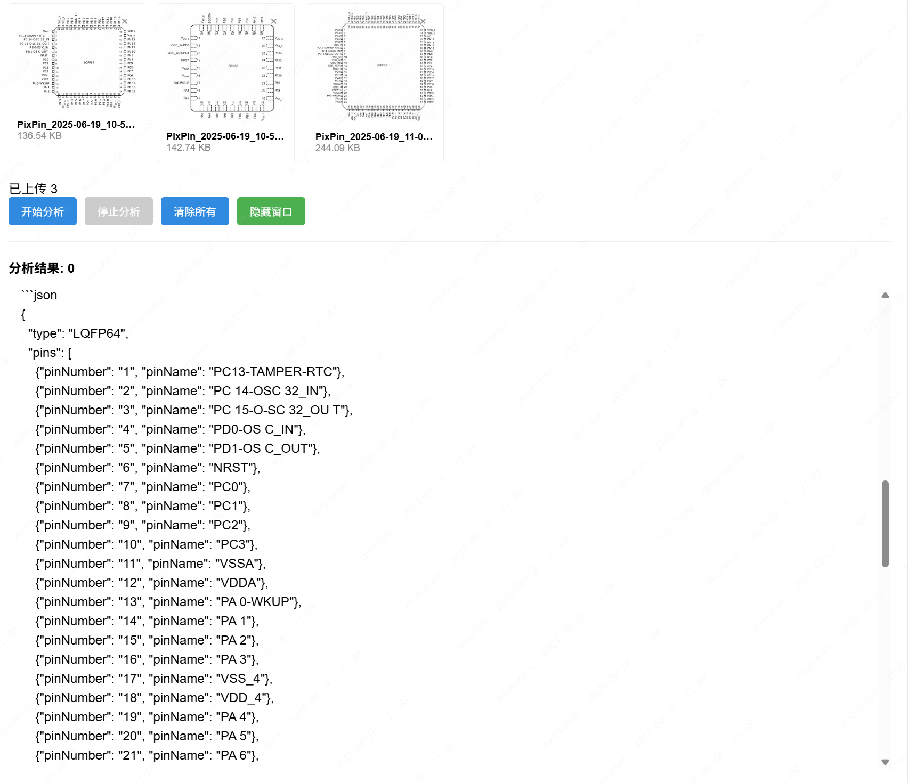
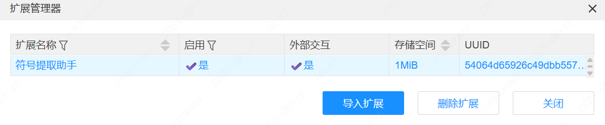
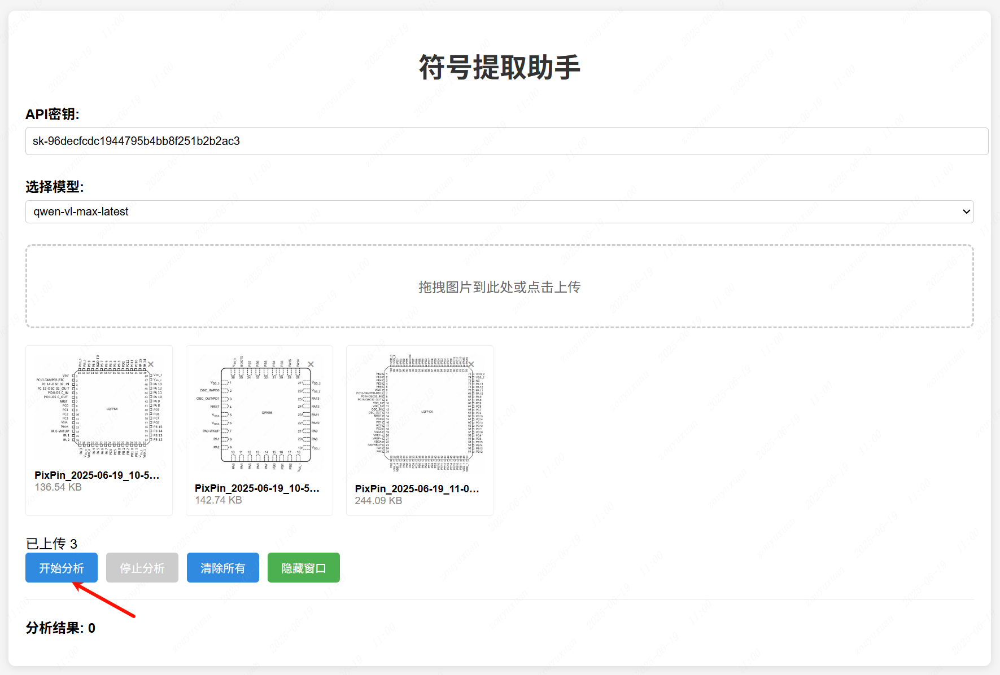
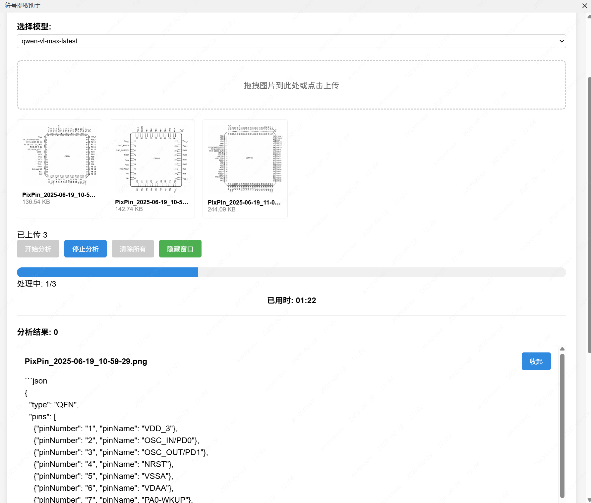
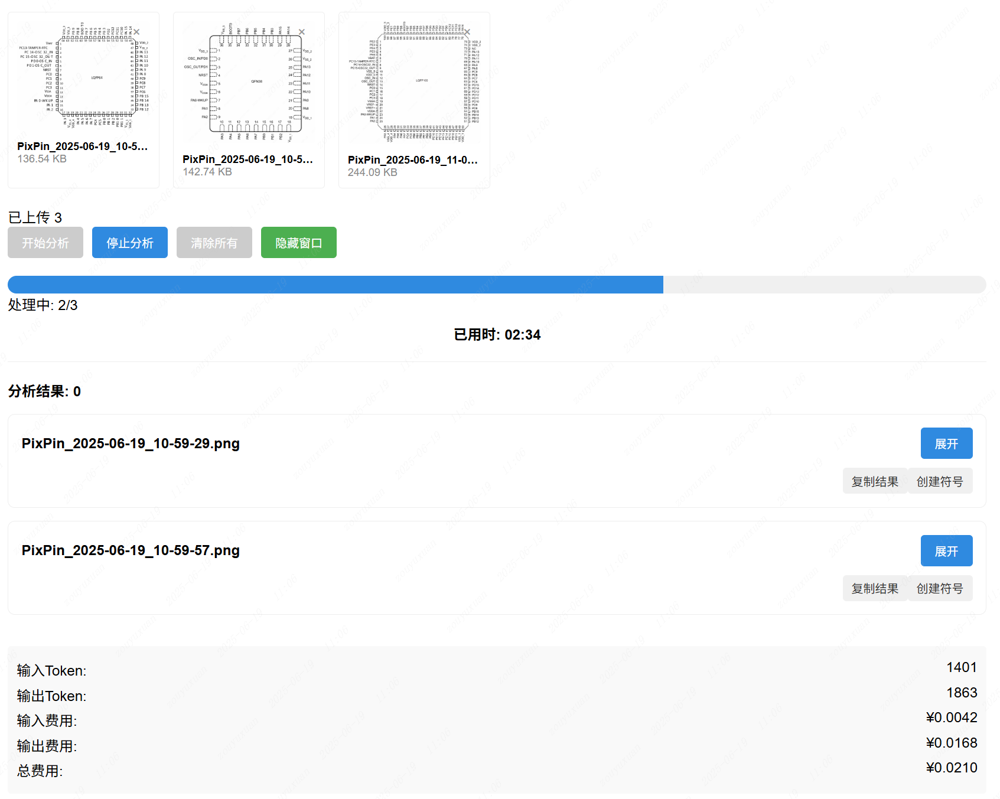

# Symbol Extraction Assistant

[中文](./README.md)

## Overview

Symbol Extraction Assistant is an intelligent tool developed for chip designers, using the Qwen2.5-VL model to extract symbol information from chip images. The extraction results are output in JSON format, containing the following fields:

- type (symbol type)
- pinNumber (pin number)
- pinName (pin name)

For example:

```json
{
	"type": "QFN",
	"pins": [
		{ "pinNumber": "1", "pinName": "DCD" },
		{ "pinNumber": "2", "pinName": "RI / CLK" }
	]
}
```

  


The analysis results support copy operations and can directly generate symbols onto the canvas.

At the bottom of the page, there is a `.zip` download function for analysis results, as well as a display of the number of Tokens consumed and the corresponding costs during the statistical analysis process.

## User Interface

Users can access the following features through the top menu bar:

- Assistant > Symbol Extraction
- Assistant > Continue Creating
- Assistant > About

## Usage Instructions

1. Enable the extension in the Extension Manager and confirm that the external interaction feature is turned on.

    

2. Log in to the Alibaba Cloud Bailian Console to obtain the API Key

[Bailian Console](https://bailian.console.aliyun.com/?tab=model#/api-key)

3. Enter the obtained API Key, select the applicable model, upload the image file, and click the `Start Analysis` button to launch the analysis task

  

4. After the analysis is complete, you can view the analysis data on the results page and directly create the symbol onto the canvas (must be operated in the symbol editing page)

  

5. The system supports viewing the number of Tokens consumed and the corresponding cost details during the analysis process, as well as providing a batch download function for analysis results

  
