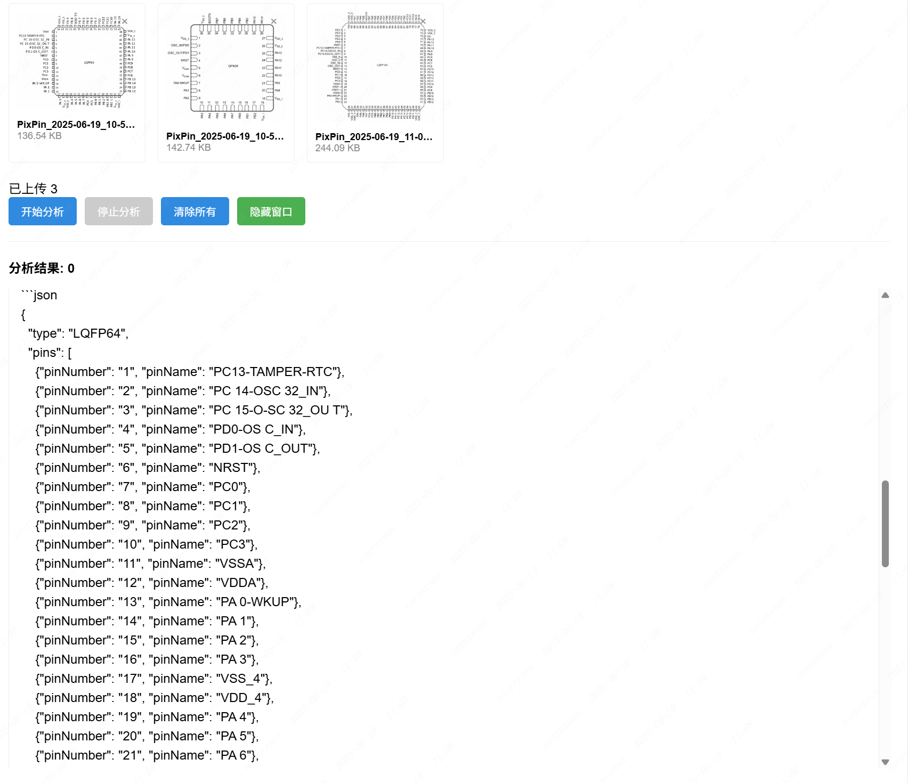
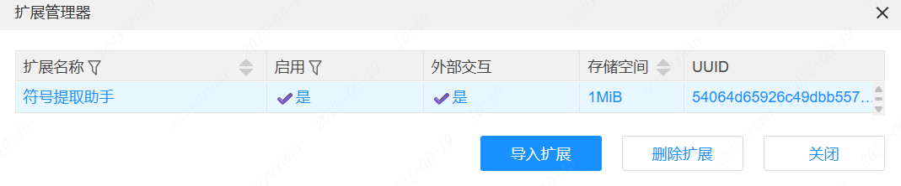
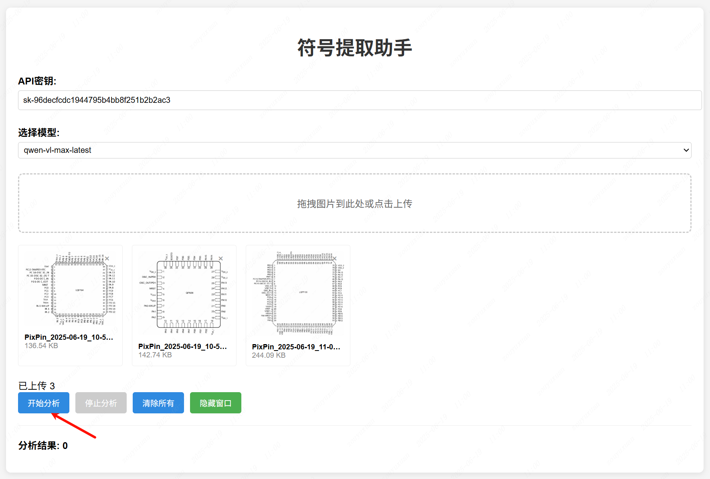
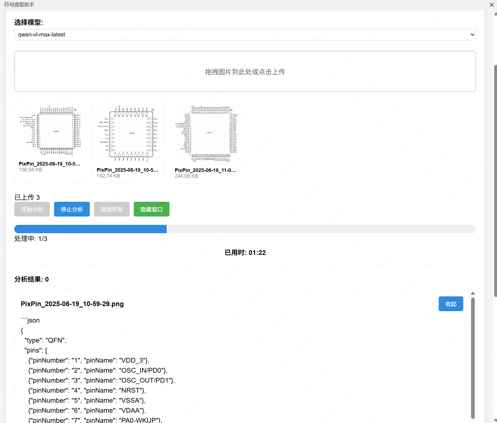
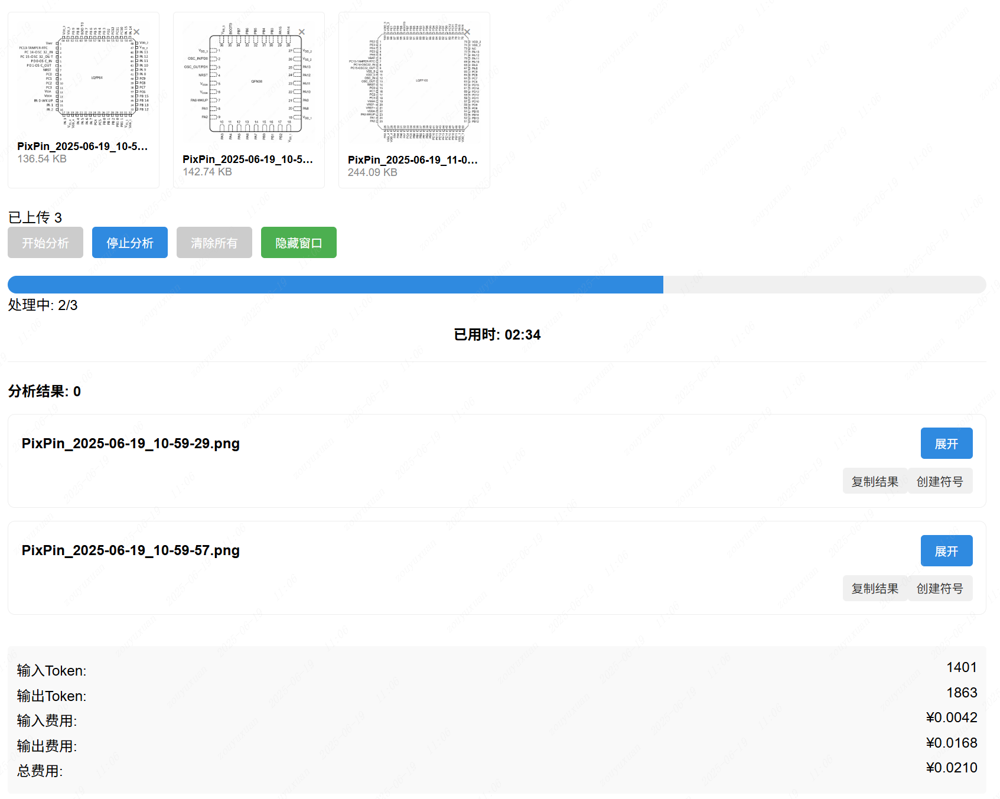

# 符号提取助手

## 功能概述

符号提取助手是一款专为芯片设计人员开发的智能工具，采用 Qwen2.5-VL 模型从芯片图片中提取符号信息。提取结果将以 JSON 格式输出，包含以下字段：

- type（符号类型）
- pinNumber（引脚编号）
- pinName（引脚名称）

例如：

```json
{
	"type": "QFN",
	"pins": [
		{ "pinNumber": "1", "pinName": "DCD" },
		{ "pinNumber": "2", "pinName": "RI / CLK" }
	]
}
```

  


分析结果支持复制操作，并可直接将符号生成至画布。

页面最下方提供分析结果 `.zip` 下载功能，同时支持展示统计分析过程中所消耗的 Token 数量及对应费用。

## 用户界面

用户可以通过顶部菜单栏访问以下功能：

- 助手 > 符号提取
- 助手 > 继续创建
- 助手 > 关于

## 使用说明

1. 在扩展管理器中启用扩展，并确认已开启外部交互功能。

    

2. 登录阿里云百练控制台，获取 API 密钥

[百练控制台](https://bailian.console.aliyun.com/?tab=model#/api-key)

3. 输入所获取的 API 密钥，选择适用的模型，上传图片文件后点击`开始分析`按钮以启动分析任务

  

4. 分析完成后，可在结果页面查看分析数据，并支持直接将符号创建至画布（需在符号编辑页面操作）

  

5. 系统支持查看分析过程中消耗的 Token 数量及对应费用明细，同时提供批量下载分析结果的功能

  

